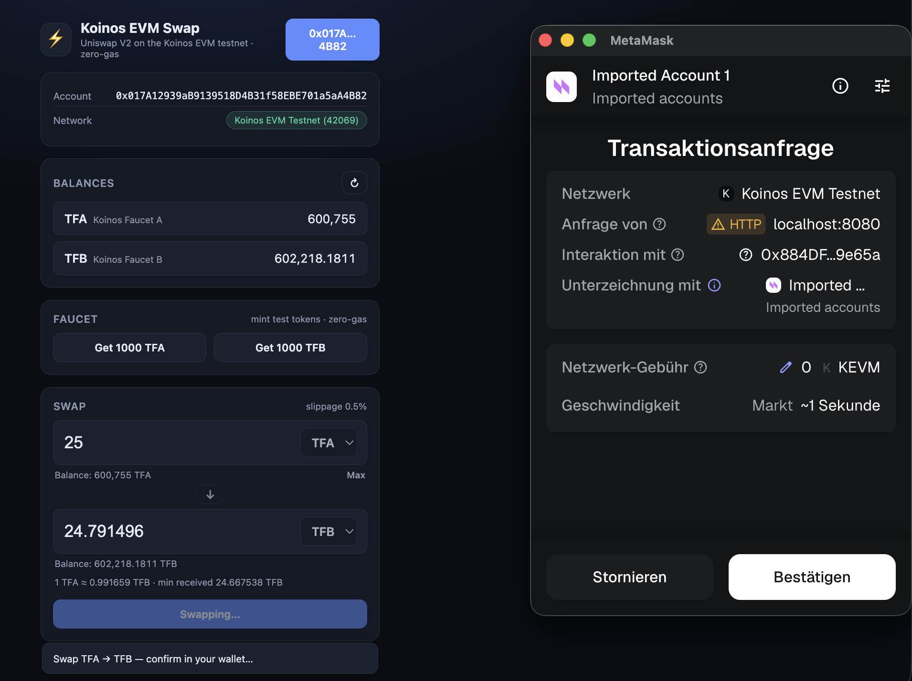
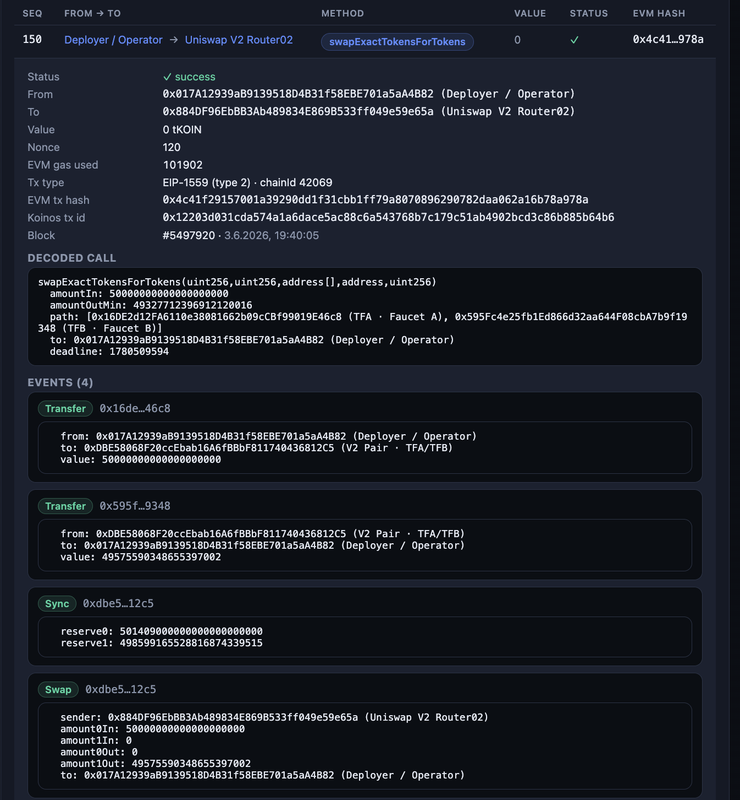
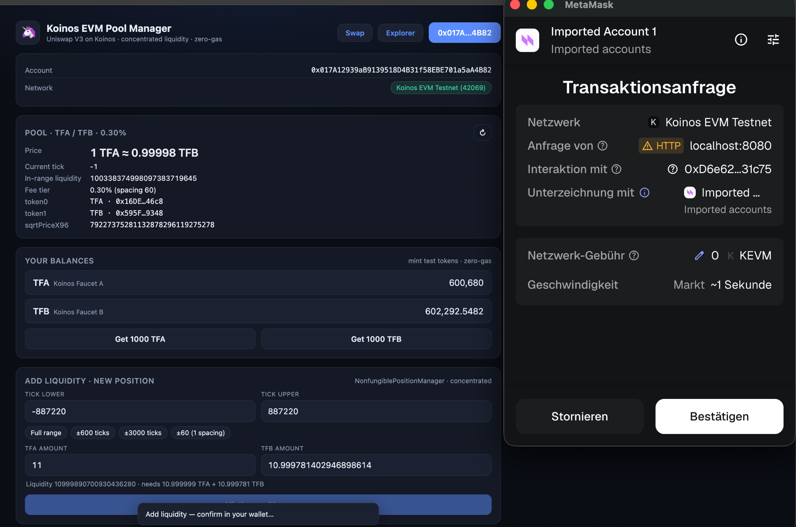
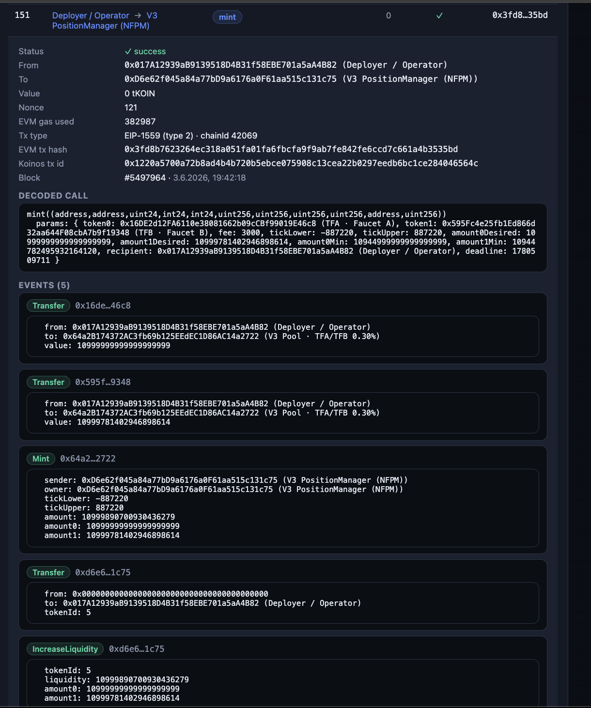
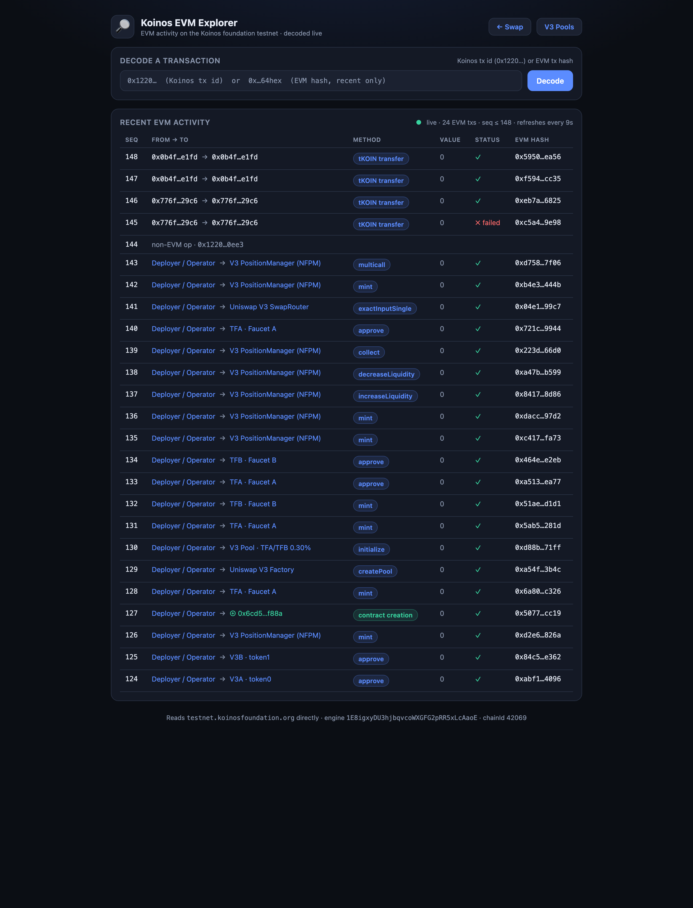

# Koinos EVM Engine

**An EVM execution layer for [Koinos](https://koinos.io) — a proof of concept that runs *unmodified*
Ethereum contract bytecode on a non-EVM L1.** A full EVM ([revm](https://github.com/bluealloy/revm)) is
compiled to WASM and deployed as a *single Koinos contract*; a JSON-RPC proxy translates Ethereum
JSON-RPC into Koinos calls, so MetaMask, `cast`, and Foundry drive it directly **for the tested paths**.
(Some read-side tooling is still partial — see the honest [Status](docs/STATUS.md).)

> **Headline result:** unmodified **Uniswap V2** and **Uniswap V3** (core *and* periphery) run on
> Koinos and produce results **byte-exact vs a mainnet reference EVM** for the exercised paths —
> concentrated liquidity, tick-crossing swaps, CREATE2, 512-bit math, NFT positions, and all.
> Live on the Koinos foundation testnet; usable through MetaMask.

> ⚠️ **Status: proof of concept / research artifact.** This is a rigorously-tested *execution core*,
> not a production network. It is single-operator, has no bridge, no fee market, and no decentralized
> relay. Read **[docs/STATUS.md](docs/STATUS.md)** before drawing conclusions. Testnet only — do not
> put anything of value behind it.

---

## What this is

The pattern is "**EVM-as-a-contract + relay**" (the same approach Aurora uses on NEAR):

- **The engine** is `revm` compiled to MVP WebAssembly and deployed as one ~407 KB Koinos contract.
  It decodes signed Ethereum transactions, recovers the sender via `ecrecover`, and executes through
  revm (CREATE/CREATE2, cross-contract calls preserving `msg.sender`, 4 precompiles) — validated
  byte-exact for the exercised Uniswap V2/V3 paths, not a blanket Ethereum-equivalence claim (see
  [docs/STATUS.md](docs/STATUS.md)). EVM accounts/code/storage live in the contract's Koinos KV space;
  EVM logs become Koinos events.
- **The proxy** is a small Rust JSON-RPC server that speaks Ethereum JSON-RPC. It wraps each user's
  signed Eth tx as a Koinos `call_contract` op, signs it with an *operator* key, and pays the Koinos
  mana — so EVM users transact **zero-gas**. Reads go through Koinos `read_contract` (free).
- **Apps** are unmodified mainnet Solidity, compiled with Foundry/Hardhat and deployed through the proxy.

```
   MetaMask / cast / ethers
            │  Ethereum JSON-RPC (chain id 42069)
            ▼
   ┌──────────────────────┐     Koinos JSON-RPC      ┌───────────────────────────┐
   │  JSON-RPC proxy (Rust)│ ───────────────────────▶ │  Koinos foundation testnet │
   │  • decode raw Eth tx  │   submit_transaction      │                            │
   │  • re-sign as Koinos  │   read_contract           │   ┌────────────────────┐   │
   │  • operator pays mana │                           │   │  EVM engine (WASM) │   │
   └──────────────────────┘                           │   │  revm + KV state   │   │
                                                       │   └────────────────────┘   │
                                                       └───────────────────────────┘
```

See **[docs/ARCHITECTURE.md](docs/ARCHITECTURE.md)** for the full design.

---

## Repository layout

```
koinos-evm/
  engine/         Rust → MVP-WASM EVM engine (revm in a Koinos contract)
    src/          lib.rs (dispatch), engine.rs, tx.rs, database.rs, precompiles.rs, koinos.rs, proto.rs, state.rs
    build.sh      cargo build + wasm-opt -Oz + MVP-opcode check
  rpc/            Rust JSON-RPC proxy (Ethereum ↔ Koinos)
    src/          main.rs, rpc.rs (dispatch), eth_tx.rs, koinos_tx.rs, koinos.rs, engine_proto.rs, state.rs
  ui/             Vanilla-JS dApps (ethers v6, no build): swap, V3 pool manager, EVM explorer
  verify_step1.sh / verify_step2.sh   on-chain receipt-status + pending-nonce checks
scripts/
  forge/          Foundry project: helper contracts + Uniswap V2/V3 build profiles (submodules)
  shell/          deploy_uniswap_v3.sh, deploy_v3_periphery.sh, deploy_faucet_tokens.sh, deploy_v3_faucet_pool.sh
docs/             ARCHITECTURE, DEPLOYMENT, TESTING, STATUS, screenshots
```

---

## Quick start

**Prerequisites:** Rust (with the `wasm32v1-none` target), [`wasm-opt`/`wasm-strip`](https://github.com/WebAssembly/binaryen)
(binaryen), [Foundry](https://book.getfoundry.sh) (`forge` + `cast`), and a funded
[Koinos foundation testnet](https://testnet.koinosfoundation.org) operator account. See
**[CONTRIBUTING.md](CONTRIBUTING.md)** for exact toolchain setup.

```bash
git clone --recurse-submodules <your-fork-url> koinos-evm-engine
cd koinos-evm-engine

# 1. Build the EVM engine (WASM) and the proxy
( cd koinos-evm/engine && ./build.sh --evm )
( cd koinos-evm/rpc    && cargo build --release )

# 2. Run the proxy + the browser dApp (you supply a funded operator key)
cd koinos-evm/ui
OPERATOR_PRIVKEY_HEX=<your-operator-key-hex> ./run.sh   # proxy :8545 + UI :8080
# open http://localhost:8080  → Connect MetaMask (it offers to add chain 42069)
```

To deploy your own contracts (engine + a fresh testnet account required), see
**[docs/DEPLOYMENT.md](docs/DEPLOYMENT.md)**. To reproduce the Uniswap V2/V3 byte-exact tests, see
**[docs/TESTING.md](docs/TESTING.md)**.

---

## The browser dApps

Three static pages (vanilla JS + ethers v6, no build step) live in `koinos-evm/ui/`:

| Page | What it does | Needs MetaMask? |
|---|---|---|
| `index.html` | Mint faucet tokens + Uniswap **V2 swap** | for writes |
| `pool.html` | Uniswap **V3 pool manager** — concentrated-liquidity positions (mint/increase/decrease/collect/burn) + V3 swap | for writes |
| `explorer.html` | **EVM explorer** — decodes every relayed tx (calldata + events) from Koinos account history | no |

### Screenshots

A full round-trip through MetaMask, then decoded in the explorer — for **both V2 and V3**. Every tx is
zero-gas (the operator pays Koinos mana).

**1. Uniswap V2 swap** — swapping TFA → TFB on the swap dApp; MetaMask signs the `swapExactTokensForTokens`.



**2. …decoded in the explorer** — the same swap, reconstructed from Koinos account history: decoded
calldata + the `Transfer` / `Sync` / `Swap` events, byte-for-byte.



**3. Uniswap V3 concentrated-liquidity mint** — adding a full-range position on the V3 pool manager;
MetaMask signs `NonfungiblePositionManager.mint`.



**4. …decoded in the explorer** — the NFPM `mint`, showing the minted NFT position (tokenId 5) plus the
`Mint` / `Transfer` / `IncreaseLiquidity` events.



The explorer also runs a **live** decoded feed of all EVM activity — no wallet required:



---

## Live deployment (foundation testnet)

These are **public** identifiers on the Koinos foundation testnet (`chain id 42069`):

| Component | Address |
|---|---|
| EVM engine (Koinos contract) | `1E8igxyDU3hjbqvcoWXGFG2pRR5xLcAaoE` |
| UniswapV2 Factory / Router02 | `0x603983bf054eeed6eed4262ee696a7b5ea1a00dd` / `0x884df96ebbb3ab489834e869b533ff049e59e65a` |
| UniswapV3 Factory | `0x7be78d086661587b6f62979bd2d5650c45e2eff1` |
| UniswapV3 SwapRouter / NFPM / QuoterV2 | `0x16ae0402bbd80d251514095c4c0f27c1cd769c70` / `0xd6e62f045a84a77bd9a6176a0f61aa515c131c75` / `0x6cd554d8c841cd2a0cf297eb49118c68d6daf88a` |
| Faucet tokens TFA / TFB | `0x16DE2d12FA6110e38081662b09cCBf99019E46c8` / `0x595Fc4e25fb1Ed866d32aa644F08cbA7b9f19348` |

(The testnet can reset; redeploy with the `scripts/shell/deploy_*.sh` scripts and update `koinos-evm/ui/config.js`.)

---

## Status — honest summary

**Proven (byte-exact vs a reference EVM, on live testnet):** Uniswap V2 full pool lifecycle; V3 core
(concentrated liquidity, bidirectional tick-crossing, exact-output, price-limit, burn/collect, fee
accrual, a second fee tier, flash, protocol fees); V3 periphery (SwapRouter, NFT positions via NFPM,
QuoterV2 deploy). MetaMask end-to-end. Honest receipt status and back-to-back nonces (see
[docs/STATUS.md](docs/STATUS.md) for the two fixes).

**Not yet (don't claim otherwise):** *not* production-ready, *not* decentralized, *not* economically
safe, *not* "standard Ethereum tooling fully works." Heavy read views (`Quoter`, `positions()`,
`getAmountsOut`) hit a per-node read-compute limit; there's no persistence/`eth_getLogs`, no
KOIN↔EVM bridge, no fee market, and a single operator key. These are the **system wrapper**, not the
execution core — the core is the hard part and it's done. Full detail + roadmap in
**[docs/STATUS.md](docs/STATUS.md)**.

---

## License

MIT (this repository's code) — see [LICENSE](LICENSE). The vendored Uniswap and OpenZeppelin
dependencies are git submodules and remain under their own licenses.

*Built by `interfecto`. Engine pattern inspired by Aurora-on-NEAR; contracts are unmodified Uniswap.*
